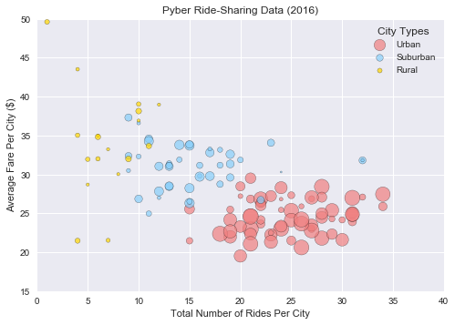
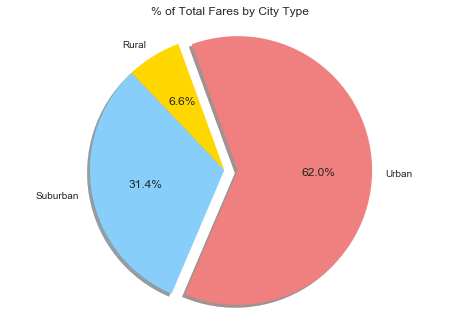
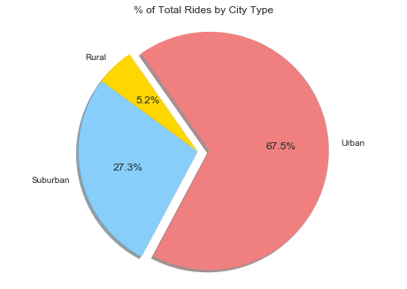
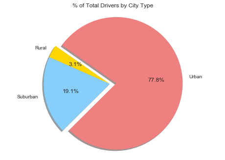

```python
# Dependencies
import pandas as pd
import matplotlib.pyplot as plt
import seaborn as sns
```


```python
# Read CSV
driverfile="city_data.csv"
driver_df=pd.read_csv(driverfile)
ridefile="ride_data.csv"
ride_df=pd.read_csv(ridefile)
```


```python
driver_df.head(3)
```


<div>
<style>
    .dataframe thead tr:only-child th {
        text-align: right;
    }

    .dataframe thead th {
        text-align: left;
    }

    .dataframe tbody tr th {
        vertical-align: top;
    }
</style>
<table border="1" class="dataframe">
  <thead>
    <tr style="text-align: right;">
      <th></th>
      <th>city</th>
      <th>driver_count</th>
      <th>type</th>
    </tr>
  </thead>
  <tbody>
    <tr>
      <th>0</th>
      <td>Kelseyland</td>
      <td>63</td>
      <td>Urban</td>
    </tr>
    <tr>
      <th>1</th>
      <td>Nguyenbury</td>
      <td>8</td>
      <td>Urban</td>
    </tr>
    <tr>
      <th>2</th>
      <td>East Douglas</td>
      <td>12</td>
      <td>Urban</td>
    </tr>
  </tbody>
</table>
</div>


```python
ride_df.head(3)
```


<div>
<style>
    .dataframe thead tr:only-child th {
        text-align: right;
    }

    .dataframe thead th {
        text-align: left;
    }

    .dataframe tbody tr th {
        vertical-align: top;
    }
</style>
<table border="1" class="dataframe">
  <thead>
    <tr style="text-align: right;">
      <th></th>
      <th>city</th>
      <th>date</th>
      <th>fare</th>
      <th>ride_id</th>
    </tr>
  </thead>
  <tbody>
    <tr>
      <th>0</th>
      <td>Sarabury</td>
      <td>2016-01-16 13:49:27</td>
      <td>38.35</td>
      <td>5403689035038</td>
    </tr>
    <tr>
      <th>1</th>
      <td>South Roy</td>
      <td>2016-01-02 18:42:34</td>
      <td>17.49</td>
      <td>4036272335942</td>
    </tr>
    <tr>
      <th>2</th>
      <td>Wiseborough</td>
      <td>2016-01-21 17:35:29</td>
      <td>44.18</td>
      <td>3645042422587</td>
    </tr>
  </tbody>
</table>
</div>


```python
# Ensure we are not missing data for the driver table
driver_df.count()
```


    city            126
    driver_count    126
    type            126
    dtype: int64


```python
# Ensure we are not missing data for the ride table
ride_df.count()
```


    city       2375
    date       2375
    fare       2375
    ride_id    2375
    dtype: int64


```python
# Ensure the ride ids are unique so that we do not have duplicate values
unique_rides = ride_df["ride_id"].nunique()
total_rides = ride_df["ride_id"].count()
if total_rides > unique_rides:
    print("The ride data has duplicate entries.")
Else: print("There are no duplicate ride entries.")
```

    There are no duplicate ride entries.
    


```python
# Make summary table that only inludes rides and fares for each city
ride_essential = ride_df[["city","fare"]]
ride_essential.head(3)
```


<div>
<style>
    .dataframe thead tr:only-child th {
        text-align: right;
    }

    .dataframe thead th {
        text-align: left;
    }

    .dataframe tbody tr th {
        vertical-align: top;
    }
</style>
<table border="1" class="dataframe">
  <thead>
    <tr style="text-align: right;">
      <th></th>
      <th>city</th>
      <th>fare</th>
    </tr>
  </thead>
  <tbody>
    <tr>
      <th>0</th>
      <td>Sarabury</td>
      <td>38.35</td>
    </tr>
    <tr>
      <th>1</th>
      <td>South Roy</td>
      <td>17.49</td>
    </tr>
    <tr>
      <th>2</th>
      <td>Wiseborough</td>
      <td>44.18</td>
    </tr>
  </tbody>
</table>
</div>


```python
# Count how many sightings have occured within each state
city_counts = ride_essential["city"].value_counts()
city_counts.head()
```


    Port Johnstad    34
    Swansonbury      34
    South Louis      32
    Port James       32
    Jacobfort        31
    Name: city, dtype: int64


```python
# Group ride information by city
grouped_ride_essential = ride_essential.groupby(["city"])
grouped_ride_essential.count().head(3)
```


<div>
<style>
    .dataframe thead tr:only-child th {
        text-align: right;
    }

    .dataframe thead th {
        text-align: left;
    }

    .dataframe tbody tr th {
        vertical-align: top;
    }
</style>
<table border="1" class="dataframe">
  <thead>
    <tr style="text-align: right;">
      <th></th>
      <th>fare</th>
    </tr>
    <tr>
      <th>city</th>
      <th></th>
    </tr>
  </thead>
  <tbody>
    <tr>
      <th>Alvarezhaven</th>
      <td>31</td>
    </tr>
    <tr>
      <th>Alyssaberg</th>
      <td>26</td>
    </tr>
    <tr>
      <th>Anitamouth</th>
      <td>9</td>
    </tr>
  </tbody>
</table>
</div>


```python
# Sum the fares per city
fares_sum = grouped_ride_essential["fare"].sum()
fares_sum.head(3)
```


    city
    Alvarezhaven    741.79
    Alyssaberg      535.85
    Anitamouth      335.84
    Name: fare, dtype: float64


```python
# Create a new DataFrame using both sum and count
grouped_ride_essential = pd.DataFrame({"Number of Rides":city_counts,
                                   "Total Fares":fares_sum})
grouped_ride_essential.head(3)
```


<div>
<style>
    .dataframe thead tr:only-child th {
        text-align: right;
    }

    .dataframe thead th {
        text-align: left;
    }

    .dataframe tbody tr th {
        vertical-align: top;
    }
</style>
<table border="1" class="dataframe">
  <thead>
    <tr style="text-align: right;">
      <th></th>
      <th>Number of Rides</th>
      <th>Total Fares</th>
    </tr>
  </thead>
  <tbody>
    <tr>
      <th>Alvarezhaven</th>
      <td>31</td>
      <td>741.79</td>
    </tr>
    <tr>
      <th>Alyssaberg</th>
      <td>26</td>
      <td>535.85</td>
    </tr>
    <tr>
      <th>Anitamouth</th>
      <td>9</td>
      <td>335.84</td>
    </tr>
  </tbody>
</table>
</div>


```python
# Add an additional column for rides that caluculates the average fare per city
grouped_ride_essential["Average Fare"] = grouped_ride_essential["Total Fares"] / grouped_ride_essential["Number of Rides"]
grouped_ride_essential.head(3)
```


<div>
<style>
    .dataframe thead tr:only-child th {
        text-align: right;
    }

    .dataframe thead th {
        text-align: left;
    }

    .dataframe tbody tr th {
        vertical-align: top;
    }
</style>
<table border="1" class="dataframe">
  <thead>
    <tr style="text-align: right;">
      <th></th>
      <th>Number of Rides</th>
      <th>Total Fares</th>
      <th>Average Fare</th>
    </tr>
  </thead>
  <tbody>
    <tr>
      <th>Alvarezhaven</th>
      <td>31</td>
      <td>741.79</td>
      <td>23.928710</td>
    </tr>
    <tr>
      <th>Alyssaberg</th>
      <td>26</td>
      <td>535.85</td>
      <td>20.609615</td>
    </tr>
    <tr>
      <th>Anitamouth</th>
      <td>9</td>
      <td>335.84</td>
      <td>37.315556</td>
    </tr>
  </tbody>
</table>
</div>


```python
# Name the index axis "city"
grouped_ride_df = pd.DataFrame(grouped_ride_essential)
grouped_ride_df = grouped_ride_df.rename_axis("city")
grouped_ride_df.head(3)

```


<div>
<style>
    .dataframe thead tr:only-child th {
        text-align: right;
    }

    .dataframe thead th {
        text-align: left;
    }

    .dataframe tbody tr th {
        vertical-align: top;
    }
</style>
<table border="1" class="dataframe">
  <thead>
    <tr style="text-align: right;">
      <th></th>
      <th>Number of Rides</th>
      <th>Total Fares</th>
      <th>Average Fare</th>
    </tr>
    <tr>
      <th>city</th>
      <th></th>
      <th></th>
      <th></th>
    </tr>
  </thead>
  <tbody>
    <tr>
      <th>Alvarezhaven</th>
      <td>31</td>
      <td>741.79</td>
      <td>23.928710</td>
    </tr>
    <tr>
      <th>Alyssaberg</th>
      <td>26</td>
      <td>535.85</td>
      <td>20.609615</td>
    </tr>
    <tr>
      <th>Anitamouth</th>
      <td>9</td>
      <td>335.84</td>
      <td>37.315556</td>
    </tr>
  </tbody>
</table>
</div>


```python
# Reset the index so we can perform a merge
grouped_ride_df.reset_index(inplace=True)
grouped_ride_df.head(3)
```


<div>
<style>
    .dataframe thead tr:only-child th {
        text-align: right;
    }

    .dataframe thead th {
        text-align: left;
    }

    .dataframe tbody tr th {
        vertical-align: top;
    }
</style>
<table border="1" class="dataframe">
  <thead>
    <tr style="text-align: right;">
      <th></th>
      <th>index</th>
      <th>city</th>
      <th>Number of Rides</th>
      <th>Total Fares</th>
      <th>Average Fare</th>
    </tr>
  </thead>
  <tbody>
    <tr>
      <th>0</th>
      <td>0</td>
      <td>Alvarezhaven</td>
      <td>31</td>
      <td>741.79</td>
      <td>23.928710</td>
    </tr>
    <tr>
      <th>1</th>
      <td>1</td>
      <td>Alyssaberg</td>
      <td>26</td>
      <td>535.85</td>
      <td>20.609615</td>
    </tr>
    <tr>
      <th>2</th>
      <td>2</td>
      <td>Anitamouth</td>
      <td>9</td>
      <td>335.84</td>
      <td>37.315556</td>
    </tr>
  </tbody>
</table>
</div>


```python
# Merge the new ride summary table with the driver table on city
merge_table = pd.merge(grouped_ride_df, driver_df, on="city", how="outer")
merge_table.head(3)
```


<div>
<style>
    .dataframe thead tr:only-child th {
        text-align: right;
    }

    .dataframe thead th {
        text-align: left;
    }

    .dataframe tbody tr th {
        vertical-align: top;
    }
</style>
<table border="1" class="dataframe">
  <thead>
    <tr style="text-align: right;">
      <th></th>
      <th>index</th>
      <th>city</th>
      <th>Number of Rides</th>
      <th>Total Fares</th>
      <th>Average Fare</th>
      <th>driver_count</th>
      <th>type</th>
    </tr>
  </thead>
  <tbody>
    <tr>
      <th>0</th>
      <td>0</td>
      <td>Alvarezhaven</td>
      <td>31</td>
      <td>741.79</td>
      <td>23.928710</td>
      <td>21</td>
      <td>Urban</td>
    </tr>
    <tr>
      <th>1</th>
      <td>1</td>
      <td>Alyssaberg</td>
      <td>26</td>
      <td>535.85</td>
      <td>20.609615</td>
      <td>67</td>
      <td>Urban</td>
    </tr>
    <tr>
      <th>2</th>
      <td>2</td>
      <td>Anitamouth</td>
      <td>9</td>
      <td>335.84</td>
      <td>37.315556</td>
      <td>16</td>
      <td>Suburban</td>
    </tr>
  </tbody>
</table>
</div>


```python
# Rename the column heads and round the average fare for more polish 
merge_table = merge_table.rename(columns={"city":"City", "driver_count":"Number of Drivers", "type":"City Type"})
merge_table = merge_table.round({"Average Fare":2})
```


```python
# Convert "Number of Rides" and "Number of Drivers" from integers to floats
merge_table["Number of Rides"] = pd.to_numeric(merge_table["Number of Rides"],downcast="float")
merge_table["Number of Drivers"] = pd.to_numeric(merge_table["Number of Drivers"],downcast="float")
merge_table.dtypes
```


    index                  int64
    City                  object
    Number of Rides      float32
    Total Fares          float64
    Average Fare         float64
    Number of Drivers    float32
    City Type             object
    dtype: object


```python
# Show final, polished data table
merge_table.head(3)
```


<div>
<style>
    .dataframe thead tr:only-child th {
        text-align: right;
    }

    .dataframe thead th {
        text-align: left;
    }

    .dataframe tbody tr th {
        vertical-align: top;
    }
</style>
<table border="1" class="dataframe">
  <thead>
    <tr style="text-align: right;">
      <th></th>
      <th>index</th>
      <th>City</th>
      <th>Number of Rides</th>
      <th>Total Fares</th>
      <th>Average Fare</th>
      <th>Number of Drivers</th>
      <th>City Type</th>
    </tr>
  </thead>
  <tbody>
    <tr>
      <th>0</th>
      <td>0</td>
      <td>Alvarezhaven</td>
      <td>31.0</td>
      <td>741.79</td>
      <td>23.93</td>
      <td>21.0</td>
      <td>Urban</td>
    </tr>
    <tr>
      <th>1</th>
      <td>1</td>
      <td>Alyssaberg</td>
      <td>26.0</td>
      <td>535.85</td>
      <td>20.61</td>
      <td>67.0</td>
      <td>Urban</td>
    </tr>
    <tr>
      <th>2</th>
      <td>2</td>
      <td>Anitamouth</td>
      <td>9.0</td>
      <td>335.84</td>
      <td>37.32</td>
      <td>16.0</td>
      <td>Suburban</td>
    </tr>
  </tbody>
</table>
</div>


```python
# Gather data for urban city plots
urban_only = merge_table.loc[merge_table["City Type"] == "Urban",:]
urban_x = urban_only["Number of Rides"]
urban_y = urban_only["Average Fare"]
urban_z = urban_only["Number of Drivers"]
```


```python
# Plot the urban city types
urban_plot = plt.scatter (urban_x, urban_y, marker = "o", s = urban_z*4, c="lightcoral", alpha = 0.7, edgecolors = "black", \
            label = "Urban")
```


```python
# Gather data for suburban city plots
suburban_only = merge_table.loc[merge_table["City Type"] == "Suburban",:]
suburban_x = suburban_only["Number of Rides"]
suburban_y = suburban_only["Average Fare"]
suburban_z = suburban_only["Number of Drivers"]
```


```python
# Plot the suburban city types
suburban_plot = plt.scatter(suburban_x, suburban_y, marker = "o", s = suburban_z*4, c="lightskyblue", alpha = 0.7, \
            edgecolors = "black", label = "Suburban")
```


```python
# Gather data for rural city plots
rural_only = merge_table.loc[merge_table["City Type"] == "Rural",:]
rural_x = rural_only["Number of Rides"]
rural_y = rural_only["Average Fare"]
rural_z = rural_only["Number of Drivers"]
```


```python
# Plot the rural city types
rural_plot = plt.scatter(rural_x, rural_y, marker = "o", s = rural_z*4, c="gold", alpha = 0.7, edgecolors = "black", \
            label = "Rural")
```


```python
# Add the labels, title, and legend
plt.xlabel("Total Number of Rides Per City")
plt.ylabel("Average Fare Per City ($)")
plt.title("Pyber Ride-Sharing Data (2016)")
plt.legend(handles=[urban_plot, suburban_plot, rural_plot],loc="upper right", title="City Types")
```


    <matplotlib.legend.Legend at 0x16ceea0c1d0>


```python
# Set limits for the displayed axis start and end points
sns.plt.xlim(0,40)
sns.plt.ylim(15,50)
```


    (15, 50)


```python
plt.show()
```





```python
# To make the pie charts, use GroupBy to group the data by city type
city_group = merge_table.groupby(['City Type'])
```


```python
# Sum needed column totals by group
total_grouped_rides = city_group["Number of Rides"].sum()
total_grouped_drivers = city_group["Number of Drivers"].sum()
total_grouped_fares = city_group["Total Fares"].sum()                                              
```


```python
# Create a new data frame with the summed values per city type
city_type_summary = pd.DataFrame({"Total Rides":total_grouped_rides,
                                 "Total Fares":total_grouped_fares,
                                 "Total Drivers":total_grouped_drivers})
city_type_summary.head()
```


<div>
<style>
    .dataframe thead tr:only-child th {
        text-align: right;
    }

    .dataframe thead th {
        text-align: left;
    }

    .dataframe tbody tr th {
        vertical-align: top;
    }
</style>
<table border="1" class="dataframe">
  <thead>
    <tr style="text-align: right;">
      <th></th>
      <th>Total Drivers</th>
      <th>Total Fares</th>
      <th>Total Rides</th>
    </tr>
    <tr>
      <th>City Type</th>
      <th></th>
      <th></th>
      <th></th>
    </tr>
  </thead>
  <tbody>
    <tr>
      <th>Rural</th>
      <td>104.0</td>
      <td>4255.09</td>
      <td>125.0</td>
    </tr>
    <tr>
      <th>Suburban</th>
      <td>638.0</td>
      <td>20335.69</td>
      <td>657.0</td>
    </tr>
    <tr>
      <th>Urban</th>
      <td>2607.0</td>
      <td>40078.34</td>
      <td>1625.0</td>
    </tr>
  </tbody>
</table>
</div>


```python
# Get the sume of drivers, fares, and rides across all city types
drivers_sum = city_type_summary['Total Drivers'].sum()
fares_sum = city_type_summary['Total Fares'].sum()
rides_sum = city_type_summary['Total Rides'].sum()
```


```python
# Calculate the percentages of the total for each city type
city_type_summary["% of Total Drivers by City Type"] = city_type_summary["Total Drivers"] / drivers_sum
city_type_summary["% of Total Fares by City Type"] = city_type_summary["Total Fares"] / fares_sum
city_type_summary["% of Total Rides by City Type"] = city_type_summary["Total Rides"] / rides_sum
city_type_summary.head()
```


<div>
<style>
    .dataframe thead tr:only-child th {
        text-align: right;
    }

    .dataframe thead th {
        text-align: left;
    }

    .dataframe tbody tr th {
        vertical-align: top;
    }
</style>
<table border="1" class="dataframe">
  <thead>
    <tr style="text-align: right;">
      <th></th>
      <th>Total Drivers</th>
      <th>Total Fares</th>
      <th>Total Rides</th>
      <th>% of Total Drivers by City Type</th>
      <th>% of Total Fares by City Type</th>
      <th>% of Total Rides by City Type</th>
    </tr>
    <tr>
      <th>City Type</th>
      <th></th>
      <th></th>
      <th></th>
      <th></th>
      <th></th>
      <th></th>
    </tr>
  </thead>
  <tbody>
    <tr>
      <th>Rural</th>
      <td>104.0</td>
      <td>4255.09</td>
      <td>125.0</td>
      <td>0.031054</td>
      <td>0.065798</td>
      <td>0.051932</td>
    </tr>
    <tr>
      <th>Suburban</th>
      <td>638.0</td>
      <td>20335.69</td>
      <td>657.0</td>
      <td>0.190505</td>
      <td>0.314458</td>
      <td>0.272954</td>
    </tr>
    <tr>
      <th>Urban</th>
      <td>2607.0</td>
      <td>40078.34</td>
      <td>1625.0</td>
      <td>0.778441</td>
      <td>0.619745</td>
      <td>0.675114</td>
    </tr>
  </tbody>
</table>
</div>


```python
# Create a new DataFrame with just the percentage results
city_percent = city_type_summary[["% of Total Fares by City Type", "% of Total Rides by City Type", \
                                  "% of Total Drivers by City Type"]]
city_percent.head()
```


<div>
<style>
    .dataframe thead tr:only-child th {
        text-align: right;
    }

    .dataframe thead th {
        text-align: left;
    }

    .dataframe tbody tr th {
        vertical-align: top;
    }
</style>
<table border="1" class="dataframe">
  <thead>
    <tr style="text-align: right;">
      <th></th>
      <th>% of Total Fares by City Type</th>
      <th>% of Total Rides by City Type</th>
      <th>% of Total Drivers by City Type</th>
    </tr>
    <tr>
      <th>City Type</th>
      <th></th>
      <th></th>
      <th></th>
    </tr>
  </thead>
  <tbody>
    <tr>
      <th>Rural</th>
      <td>0.065798</td>
      <td>0.051932</td>
      <td>0.031054</td>
    </tr>
    <tr>
      <th>Suburban</th>
      <td>0.314458</td>
      <td>0.272954</td>
      <td>0.190505</td>
    </tr>
    <tr>
      <th>Urban</th>
      <td>0.619745</td>
      <td>0.675114</td>
      <td>0.778441</td>
    </tr>
  </tbody>
</table>
</div>


```python
# Reset the index so we can use the city types as labels
city_percent.reset_index(inplace=True)
city_percent.head(3)
```


<div>
<style>
    .dataframe thead tr:only-child th {
        text-align: right;
    }

    .dataframe thead th {
        text-align: left;
    }

    .dataframe tbody tr th {
        vertical-align: top;
    }
</style>
<table border="1" class="dataframe">
  <thead>
    <tr style="text-align: right;">
      <th></th>
      <th>City Type</th>
      <th>% of Total Fares by City Type</th>
      <th>% of Total Rides by City Type</th>
      <th>% of Total Drivers by City Type</th>
    </tr>
  </thead>
  <tbody>
    <tr>
      <th>0</th>
      <td>Rural</td>
      <td>0.065798</td>
      <td>0.051932</td>
      <td>0.031054</td>
    </tr>
    <tr>
      <th>1</th>
      <td>Suburban</td>
      <td>0.314458</td>
      <td>0.272954</td>
      <td>0.190505</td>
    </tr>
    <tr>
      <th>2</th>
      <td>Urban</td>
      <td>0.619745</td>
      <td>0.675114</td>
      <td>0.778441</td>
    </tr>
  </tbody>
</table>
</div>


```python
# Turn the columns into lists that we can use to create our pie charts
city_type_list = city_percent["City Type"].tolist()
fares_list = city_percent["% of Total Fares by City Type"].tolist()
rides_list = city_percent["% of Total Rides by City Type"].tolist()
drivers_list = city_percent["% of Total Drivers by City Type"].tolist()
```


```python
# Create other lists for pie parameters
labels = city_type_list
colors = ["gold","lightskyblue","lightcoral"]
explode = [0,0,0.1]
```


```python
# Create the pie chart for fares
plt.pie(fares_list, explode=explode, labels=labels, colors=colors,
        autopct="%1.1f%%", shadow=True, startangle=110)
```


    ([<matplotlib.patches.Wedge at 0x1f793b4add8>,
      <matplotlib.patches.Wedge at 0x1f793b5c6d8>,
      <matplotlib.patches.Wedge at 0x1f793b62f98>],
     [<matplotlib.text.Text at 0x1f793b54be0>,
      <matplotlib.text.Text at 0x1f793b624e0>,
      <matplotlib.text.Text at 0x1f793b6dda0>],
     [<matplotlib.text.Text at 0x1f793b5c198>,
      <matplotlib.text.Text at 0x1f793b62a58>,
      <matplotlib.text.Text at 0x1f793b74358>])


```python
# Tells matplotlib that we want a pie chart with equal axes
plt.axis("equal")
```


    (-1.1193511336324631,
     1.2098918162745769,
     -1.1139723195486728,
     1.1113535237134873)


```python
# Title the pie chart
plt.title("% of Total Fares by City Type")
```


    <matplotlib.text.Text at 0x1f793b1cef0>


```python
# Print the pie chart showing relative fares to city type
plt.show()
```





```python
# Create the pie chart for rides
plt.pie(rides_list, explode=explode, labels=labels, colors=colors,
        autopct="%1.1f%%", shadow=True, startangle=125)
```


    ([<matplotlib.patches.Wedge at 0x1f793bf2780>,
      <matplotlib.patches.Wedge at 0x1f793c03080>,
      <matplotlib.patches.Wedge at 0x1f793c0b940>],
     [<matplotlib.text.Text at 0x1f793bf8588>,
      <matplotlib.text.Text at 0x1f793c03e48>,
      <matplotlib.text.Text at 0x1f793c13748>],
     [<matplotlib.text.Text at 0x1f793bf8b00>,
      <matplotlib.text.Text at 0x1f793c0b400>,
      <matplotlib.text.Text at 0x1f793c13cc0>])


```python
# Tells matplotlib that we want a pie chart with equal axes
plt.axis("equal")
```


    (-1.1141248072782859,
     1.2146131553007196,
     -1.1012276972371349,
     1.1180133089837063)


```python
# Title the pie chart
plt.title("% of Total Rides by City Type")
```


    <matplotlib.text.Text at 0x1f793bbdcf8>


```python
# Print the pie chart showing relative rides to city type
plt.show()
```





```python
# Create the pie chart for drivers
plt.pie(drivers_list, explode=explode, labels=labels, colors=colors,
        autopct="%1.1f%%", shadow=True, startangle=145)
```


    ([<matplotlib.patches.Wedge at 0x1f793c82278>,
      <matplotlib.patches.Wedge at 0x1f793c89b38>,
      <matplotlib.patches.Wedge at 0x1f793c9c438>],
     [<matplotlib.text.Text at 0x1f793c89080>,
      <matplotlib.text.Text at 0x1f793c92940>,
      <matplotlib.text.Text at 0x1f793ca2240>],
     [<matplotlib.text.Text at 0x1f793c895f8>,
      <matplotlib.text.Text at 0x1f793c92eb8>,
      <matplotlib.text.Text at 0x1f793ca27b8>])


```python
# Tells matplotlib that we want a pie chart with equal axes
plt.axis("equal")
```


    (-1.1260995696732405,
     1.2109262754682366,
     -1.0967726513814324,
     1.1123795143703721)


```python
# Title the pie chart
plt.title("% of Total Drivers by City Type")
```


    <matplotlib.text.Text at 0x1f793c55390>


```python
# Print the pie chart showing relative drivers to city type
plt.show()
```





```python
# In general, the larger the city, 1) the fewer the number of rides, 2) the fewer the number of drivers, and
#    3) the higher the fare.
```
